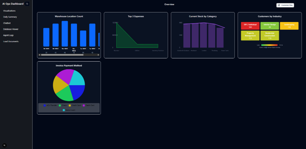

# multi-agent-ai-operations-dashboard
A local‑only AI Ops Dashboard powered by a multi‑agent system, shared vector memory, and a RAG pipeline. Includes five domain agents, a Supervisor agent, LLM integration, and a functional dashboard UI built entirely with free, local, and using open‑source tools.

--This project is in development. This is my master’s capstone project.

